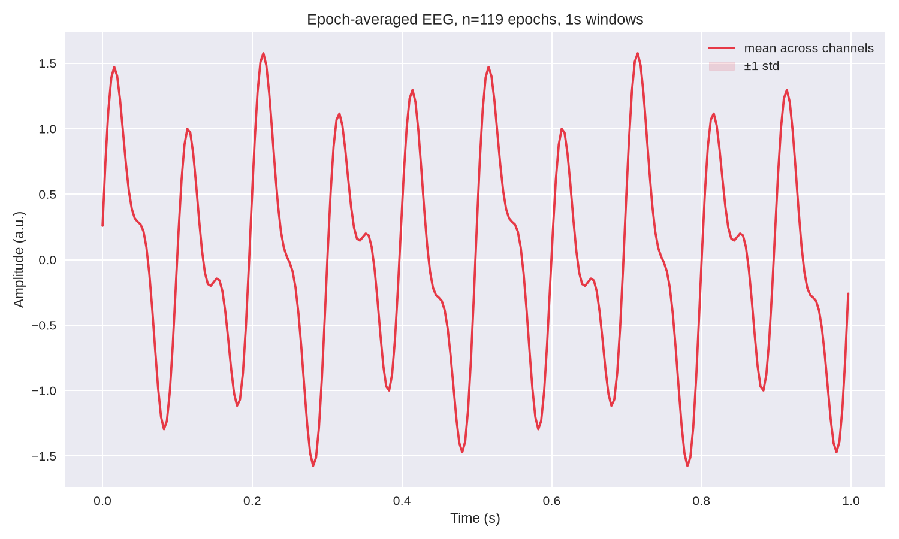
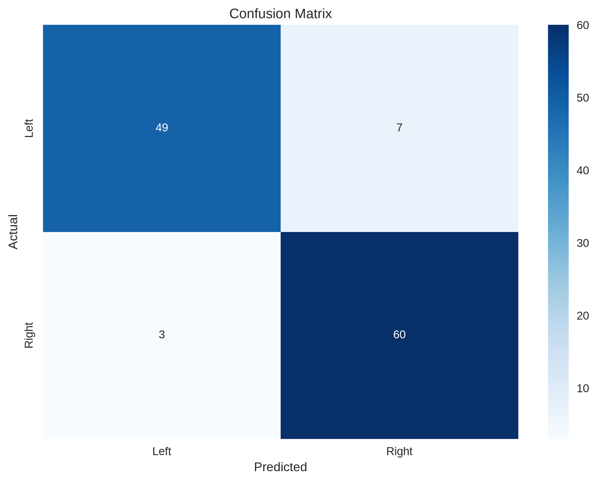
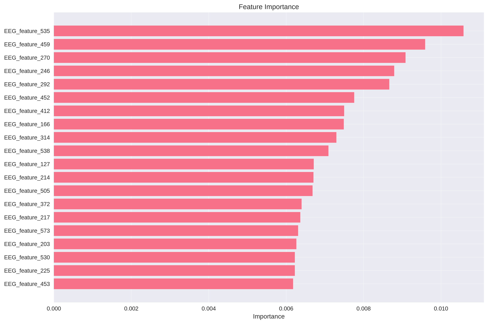

# Brainwave Analysis

Research code from my junior-year work with the Meki lab at UC Berkeley, predicting gaze
direction (left vs. right) from EEG/EOG signals for exoskeleton control. The idea: if the
exoskeleton can tell where you're looking, it can anticipate movement intent instead of
just reacting to it.

## What I actually built

A full pipeline, not just a model:

1. **Data loading**: reads EEG/EOG in FIF, EDF, BDF, EEGLAB, or BrainVision format.
2. **Preprocessing**: Butterworth bandpass filtering to cut noise, then artifact removal.
3. **Feature extraction**: statistical, spectral, and temporal features per epoch (792 in
   the current run).
4. **Classification**: Random Forest, SVM, or a small neural net, swappable via config.
5. **Evaluation**: held-out test accuracy, k-fold cross-validation, confusion matrix,
   feature importance.

I split this into proper modules (`src/data`, `src/preprocessing`, `src/ml`,
`src/visualization`) instead of leaving it as one script, added a YAML config so the
pipeline isn't hardcoded to one dataset or one model, and wrote tests for the pipeline
itself. There's also a `predict()` path for scoring new EEG/EOG windows once a model's
trained, which is what you'd actually need for real-time exoskeleton control instead of a
one-off offline analysis.

## Results

Random Forest on the current dataset (119 samples, 792 features):






- Test accuracy: 0.916
- 5-fold CV mean: 0.516 ± 0.052

That gap between test accuracy and CV mean is real and worth being upfront about: with 792
features and 119 samples, a single train/test split can look better than the model actually
generalizes. CV is the more honest number here. More data and feature selection would be
the obvious next steps before trusting this for anything real-time.



## Running it

```bash
git clone https://github.com/zainkhatri/exoskeleton-brainwave-algorithm.git
cd exoskeleton-brainwave-algorithm
pip install -r requirements.txt
pip install -e .
```

```python
from brainwave_analysis import BrainwaveAnalysisPipeline

pipeline = BrainwaveAnalysisPipeline()
results = pipeline.run_full_pipeline(use_sample_data=True, create_plots=True)
print(f"Accuracy: {results['final_results']['accuracy']:.3f}")
```

Against real data instead of the MNE sample set:

```python
results = pipeline.run_full_pipeline(
    eeg_file="path/to/eeg_data.fif",
    eog_file="path/to/eog_data.fif",
    use_sample_data=False,
    hyperparameter_tuning=True,
)
```

Predicting on new data after training:

```python
prediction = pipeline.predict(new_eeg_data, new_eog_data)
print(prediction["gaze_direction"], prediction["confidence"])
```

## Layout

```
src/
├── data/           # loading FIF/EDF/BDF/EEGLAB/BrainVision
├── preprocessing/  # filtering, artifact removal, feature extraction
├── ml/             # GazeDirectionClassifier, EnsembleClassifier
├── visualization/  # plots
├── utils/          # config
└── pipeline.py     # ties it together
configs/            # YAML config (sample rate, filter cutoffs, model type, CV folds)
examples/
tests/
```

## Tests

```bash
pytest tests/
```
